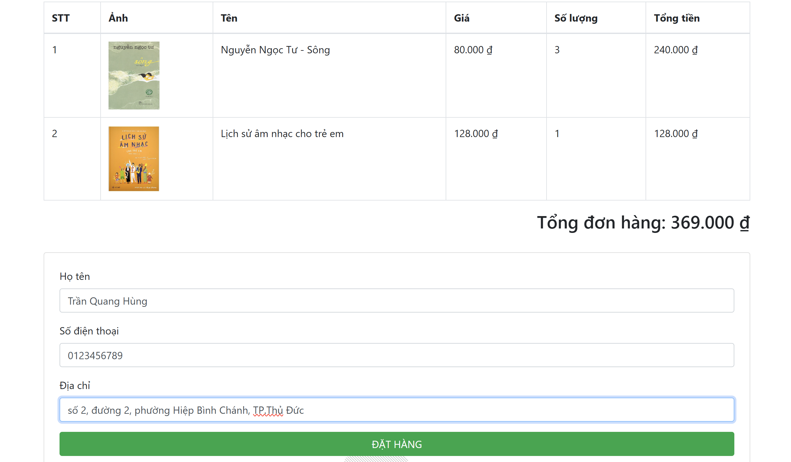

# Book Management and E-commerce System


This is book management and e-commerce platform built with Node.js, Express, and MongoDB. This system allows customers to browse, search, and purchase books while providing administrators with powerful management tools.

## Features

### Customer Features
- **User Authentication**
  - Register, login, and profile management
  - Password recovery through email verification

- **Product Browsing**
  - Browse books by categories
  - Advanced search with filters

- **Shopping Experience**
  - Shopping cart management
  - Checkout process

- **Payment Integration**
  - Secure payment through ZaloPay API
  - Real-time payment confirmation

- **User Interaction**
  - Real-time chat support (in development)
  
### Admin Features
- **Dashboard Overview**
  - Statistics on products, categories, admin accounts, and user accounts

- **Product Management**
  - Create, read, update, and delete (CRUD) operations for books
  - Bulk actions for multiple products
  - Image upload via Cloudinary
  - Rich text editing with TinyMCE

- **Category Management**
  - Hierarchical category structure
  - Category-specific settings

- **User Management**
  - Admin user management
  - Customer account oversight
  - Access control groups

- **Permission System**
  - Role-based access control
  - Custom permission groups
  - Feature-level permission assignment

- **General Settings**
  - Website information configuration
  - Email templates

## Technology Stack

### Frontend
- Pug templating engine
- CSS3 with Bootstrap 5
- JavaScript (ES6+)
- AJAX for asynchronous operations

### Backend
- Node.js
- Express.js
- MongoDB with Mongoose ODM
- Socket.IO for real-time functionality

### External Services & APIs
- Cloudinary for image upload and management
- TinyMCE for rich text editing
- ZaloPay for payment processing
- Nodemailer for email services

## Screenshots

### Customer Interface

#### Home Page


#### Product Detail


#### Shopping Cart


#### Checkout Process



### Admin Interface

#### Admin Dashboard


#### Product Management


#### Category Management


#### Permission Management


#### General Information


## Installation

```bash
# Clone the repository
git clone https://github.com/NgKhao/product-management.git
cd product-management

# Install dependencies
npm install

# Set up environment variables
cp .env.example .env
# Update the .env file with your configuration

# For production
npm start
```

## Environment Variables

Create a `.env` file in the root directory with the following variables:

## Project Structure

```
product-management/
├── config/                 # Configuration files
├── controllers/            # Request handlers
├── heplers/                 
├── middleware/             # Custom middleware
├── models/                 # Mongoose models
├── public/                 # Static files
├── routes/                 # Route definitions
├── sockets/                
├── validate/             
├── views/                  # Pug templates
├── .env                    # Environment variables
├── .gitignore
├── index.js                  # Application entry point
├── package.json
└── README.md
```


## Contributing

1. Fork the repository
2. Create your feature branch (`git checkout -b feature/amazing-feature`)
3. Commit your changes (`git commit -m 'Add some amazing feature'`)
4. Push to the branch (`git push origin feature/amazing-feature`)
5. Open a Pull Request

## Contact

- Developer: [Khao Nguyen](https://github.com/NgKhao)
- Project Link: [https://github.com/NgKhao/product-management](https://github.com/NgKhao/product-management)